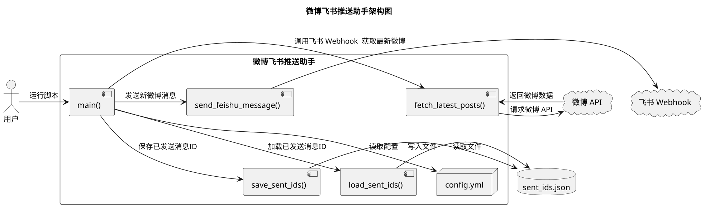

# 微博飞书推送助手

欢迎来到 **微博飞书推送助手** 项目！🎉

你是否曾经因为错过微博上关注的用户的最新动态而感到遗憾？你是否希望能第一时间在飞书上收到他们的更新？现在，这个项目将帮助你实现这个愿望！✨

## 启动


### 前置准备步骤

通过 [创建自定义机器人](https://open.larkoffice.com/document/client-docs/bot-v3/add-custom-bot?lang=zh-CN) 获取webhook的url和secret。


```bash
安装环境
pip install -r requirement.txt
```

```bash
cp config_demo.yml config.yml
rm sent_ids.json
python3 -m app.wb_monitor
```

## 项目简介

微博飞书推送助手是一个用 Python 编写的脚本，它可以定时获取指定微博用户的最新动态，并通过飞书 Webhook 将消息推送到你的飞书群聊中。项目支持：

- **多用户监控**：你可以同时监控多个微博用户的最新动态。
- **飞书卡片消息**：以美观的卡片形式在飞书中展示微博内容。
- **签名校验**：支持飞书 Webhook 的签名校验，确保消息安全可靠。
- **自定义配置**：所有配置都集中在 `config.yml` 文件中，方便管理和修改。

## 项目架构

下面是项目的整体架构设计：



## 模块说明

### 1. config.yml 配置文件 📄

这是项目的配置中心，你可以在这里设置：

- **user_ids**：你想要监控的微博用户ID列表。
- **feishu**：
  - **webhook_url**：你的飞书 Webhook 地址。
  - **webhook_secret**：飞书 Webhook 的密钥（如果未启用签名校验，可以留空）。
- **sent_ids_file**：已发送消息ID存储的文件名。

### 2. main() 主函数 🚀

这是脚本的入口点，主要完成以下工作：

- **读取配置**：从 `config.yml` 中获取所有必要的配置信息。
- **加载已发送消息ID**：防止重复发送相同的微博内容。
- **遍历用户ID列表**：对每个用户，获取最新的微博动态。
- **发送新微博消息**：通过飞书 Webhook，将新微博推送到飞书。
- **保存已发送消息ID**：更新已发送的微博ID列表。

### 3. fetch_latest_posts() 获取最新微博 📰

这个函数负责：

- **请求微博 API**：获取指定用户的最新微博数据。
- **解析微博内容**：提取微博ID、用户名和文本内容，去除HTML标签，获取纯文本。
- **返回微博列表**：提供给主函数处理的新微博数据。

### 4. load_sent_ids() 加载已发送消息ID 📥

- **读取 sent_ids.json 文件**：获取已发送的微博ID，防止重复发送。
- **返回已发送ID字典**：以用户ID为键，已发送微博ID集合为值。

### 5. save_sent_ids() 保存已发送消息ID 📤

- **更新 sent_ids.json 文件**：将新的已发送微博ID写入文件，保持记录。

### 6. send_feishu_message() 发送飞书消息 ✉️

- **构建卡片消息**：以卡片形式组织微博内容，标题为用户名，内容为微博文本。
- **签名校验**：如果配置了密钥，计算签名，确保消息安全。
- **调用飞书 Webhook**：发送卡片消息到飞书群聊中。

## 使用指南

1. **克隆项目**

   ```bash
   git clone https://github.com/yourusername/weibo-feishu-notifier.git
   cd weibo-feishu-notifier
   ```

2. **安装依赖**

   ```bash
   pip install -r requirements.txt
   ```

3. **配置项目**

   编辑 `config.yml` 文件，按照注释填写你的微博用户ID、飞书 Webhook 地址和密钥等信息。

4. **运行脚本**

   ```bash
   python your_script_name.py
   ```

5. **定时执行（可选）**

   你可以使用 `cron` 或 Windows 任务计划程序定期运行该脚本，以持续获取最新微博动态。

## 注意事项

- **配置安全**：请确保 `config.yml` 中的敏感信息安全，不要上传到公共仓库。
- **权限要求**：脚本需要访问互联网和读写本地文件的权限。
- **编码问题**：确保文件编码为 UTF-8，避免中文字符显示异常。

## 结语

这个项目旨在帮助你轻松获取微博上关注用户的最新动态，并通过飞书及时通知你。希望你能喜欢并善加利用！如果有任何问题或建议，欢迎提出！😊
